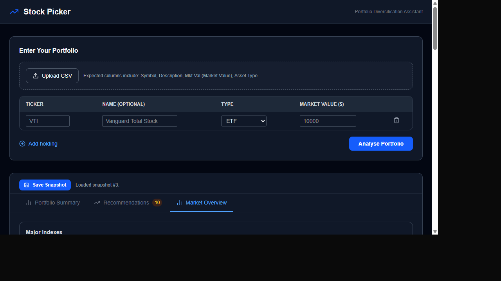
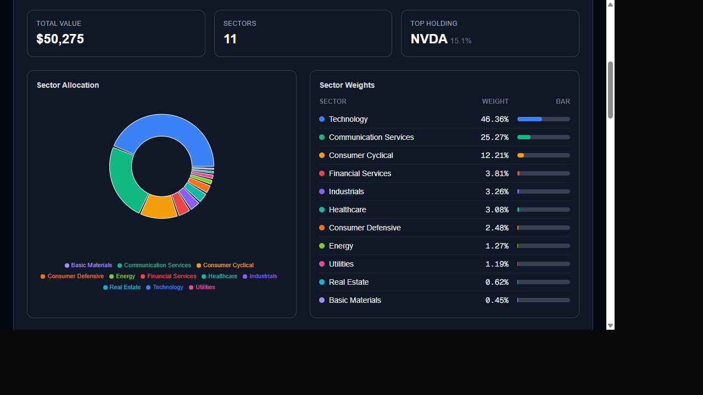
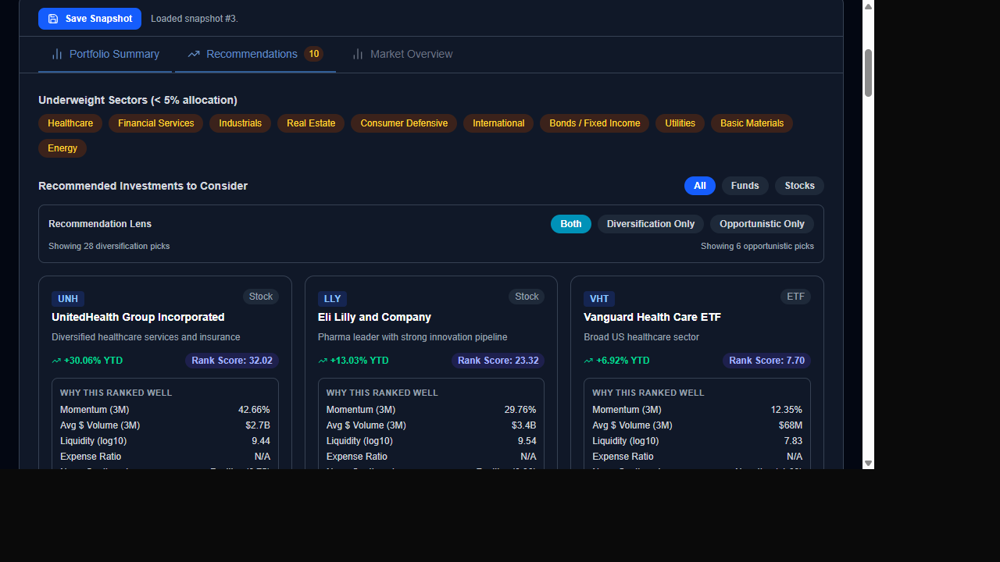
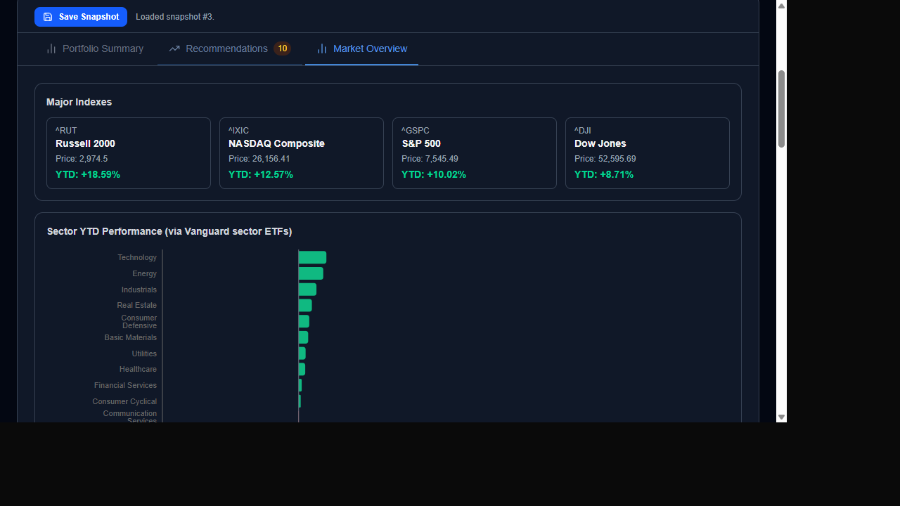
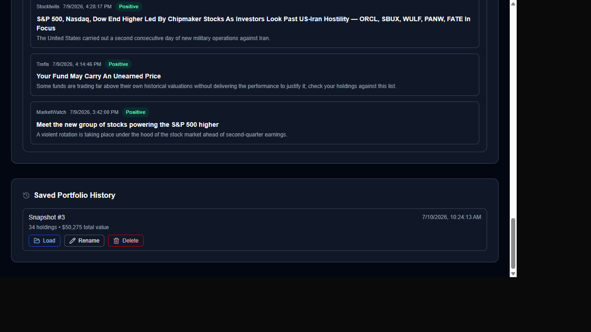

# Stock Picker – Portfolio Diversification Assistant

Stock Picker analyses your investment portfolio, shows how your money is spread across market sectors, highlights gaps in diversification, and recommends funds or stocks to consider. All data is fetched live from Yahoo Finance — no account or subscription needed.

---

## Table of Contents

1. [Quick Start (Windows .exe)](#quick-start)
2. [Entering Your Portfolio](#entering-your-portfolio)
   - [Manual entry](#manual-entry)
   - [CSV import](#csv-import)
3. [Portfolio Summary tab](#portfolio-summary-tab)
4. [Recommendations tab](#recommendations-tab)
5. [Market Overview tab](#market-overview-tab)
6. [Saving, loading & managing snapshots](#saving-and-managing-snapshots)
7. [Developer setup](#developer-setup)
8. [Building the .exe yourself](#building-the-exe)
9. [Frequently asked questions](#faq)

---

## Quick Start

> **No Python or Node.js installation required.**

1. Copy `StockPicker.exe` to any folder on your Windows PC (e.g. `Documents\StockPicker\`).
2. Double-click `StockPicker.exe`.
3. A small terminal window appears briefly while the server starts, then your default browser opens automatically at `http://localhost:8000`.
4. The terminal window stays open while the app runs — **do not close it**.
5. When you are finished, close the terminal window (or press `Ctrl+C` inside it) to shut down the app.

> **Tip:** Your saved portfolio history is stored in `stock_picker.db` in the same folder as the `.exe`. Keep that file alongside the `.exe` to preserve your history between sessions.

---

## Entering Your Portfolio



### Manual Entry

1. Each row in the table represents one holding. Fill in:
   | Column | What to enter |
   |---|---|
   | **Ticker** | The stock or fund symbol (e.g. `VTI`, `AAPL`, `FXAIX`). Required. |
   | **Name** | A friendly label — optional, for your own reference. |
   | **Type** | `ETF`, `Mutual Fund`, or `Stock`. Affects how the app looks through fund holdings. |
   | **Market Value ($)** | The current dollar value of your position. Required. |
2. Click **+ Add holding** to add more rows. Up to 10 rows are shown per page; use the arrows to navigate pages.
3. Click the trash icon on any row to remove it.
4. When all holdings are entered, click **Analyse Portfolio**.

> Analysis typically takes 5–15 seconds because market data is fetched live from Yahoo Finance.

### CSV Import

If your brokerage lets you export a CSV of your positions, you can import it directly:

1. Export a holdings CSV from your brokerage (Fidelity, Schwab, TD Ameritrade, etc.).
2. Click **Upload CSV** at the top of the portfolio form.
3. Select your file. The app looks for columns named `Symbol`, `Description`, `Mkt Val (Market Value)`, and `Asset Type`.
4. Matched rows populate the table automatically — review them and click **Analyse Portfolio**.

> Cash positions, money-market rows, and other non-equity rows are filtered out automatically.

---

## Portfolio Summary Tab



After analysis, the **Portfolio Summary** tab is shown first. It contains three sections:

### KPI Cards
| Card | Meaning |
|---|---|
| **Total Value** | Sum of all holdings you entered. |
| **Sectors** | Number of distinct market sectors your portfolio spans. |
| **Top Holding** | The single largest position by portfolio weight. |

### Sector Allocation (donut chart + weight table)
Shows how your portfolio is split across GICS sectors (Technology, Healthcare, Financials, etc.). The weight for each sector is calculated by looking through ETF and mutual-fund holdings using Yahoo Finance's disclosed composition data.

### Overlap Watch
If you own a stock both directly **and** through a fund, the Overlap Watch table shows the combined exposure so you know your true concentration.

---

## Recommendations Tab



The Recommendations tab identifies sectors where your allocation is below 5 % and suggests investments to fill those gaps.

### Underweight Sectors
Orange pill badges list every sector where you have less than 5 % portfolio weight. These are the gaps the recommendations aim to address.

### Recommendation Lens
Use the **Both / Diversification Only / Opportunistic Only** toggle to focus on the type of recommendation you want:

| Lens | What it shows |
|---|---|
| **Both** | All recommendations (default). |
| **Diversification Only** | Picks chosen specifically to fill your sector gaps. |
| **Opportunistic Only** | Picks with strong momentum and positive sentiment, regardless of sector. |

### Filter by Type
Use the **All / Funds / Stocks** toggle to show only ETFs & mutual funds or only individual stocks.

### Recommendation Cards
Each card shows:
- **Ticker & name** with a category badge (ETF / Mutual Fund / Stock).
- **YTD return** — year-to-date price performance.
- **Rank Score** — a composite score combining momentum, liquidity, expense ratio, and news sentiment. Higher is better.
- **Why this ranked well** — a breakdown of the factors that drove the score:
  | Factor | What it means |
  |---|---|
  | Momentum (3M) | 3-month price change — positive momentum is rewarded. |
  | Avg $ Volume (3M) | Average daily dollar trading volume — higher means easier to buy/sell. |
  | Liquidity (log10) | Log-scaled liquidity score derived from volume. |
  | Expense Ratio | Annual fund cost (ETFs/funds only) — lower is better. |
  | News Sentiment | Aggregate sentiment of recent news stories. |
  | Next Earnings | Days until the next earnings report (stocks only). |

> **This is not financial advice.** Recommendations are generated algorithmically from public market data. Always do your own research before investing.

---

## Market Overview Tab



The **Market Overview** tab shows broad market context updated each time you run an analysis.

### Major Indexes
Year-to-date performance cards for the S&P 500, NASDAQ Composite, Dow Jones, and Russell 2000.

### Sector YTD Performance
A horizontal bar chart comparing every sector's year-to-date return, sourced from Vanguard's sector ETFs. Green bars indicate positive performance; red bars indicate negative.

### Market Stories
Below the chart, recent news headlines with AI-scored sentiment (Positive / Neutral / Negative) give a qualitative sense of market mood.

---

## Saving and Managing Snapshots



Stock Picker lets you save point-in-time snapshots of your portfolio and results so you can track changes over time.

### Saving a Snapshot
After running an analysis, click **Save Snapshot** in the results header. The snapshot stores your holdings, sector summary, and recommendations at that moment.

### Loading a Snapshot
In the **Saved Portfolio History** section at the bottom of the page, each saved snapshot shows:
- Its snapshot number and optional label.
- The date and time it was saved.
- Number of holdings and total value.

Click **Load** to restore that snapshot's holdings and results instantly (market data is refreshed from Yahoo Finance at load time).

### Renaming a Snapshot
Click **Rename** on any snapshot, type a descriptive label (e.g. `Q3 2025 rebalance`), and press **Enter** or click **Save**.

### Deleting a Snapshot
Click **Delete** and confirm. Deleted snapshots cannot be recovered.

---

## Developer Setup

If you want to run or modify the source code directly:

### Prerequisites
- Python 3.10 or later
- Node.js 18 or later

### Backend

```bash
cd backend
python -m venv .venv
# Windows:
.venv\Scripts\activate
# macOS/Linux:
source .venv/bin/activate

pip install -r requirements.txt
uvicorn main:app --reload
# API available at http://localhost:8000
```

### Frontend (development)

```bash
cd frontend
npm install
npm run dev
# UI available at http://localhost:3000
```

---

## Building the .exe

To produce a fresh `StockPicker.exe` after code changes:

```powershell
# From the repo root, with your Python virtualenv active:
.\build.ps1
```

The script:
1. Builds the Next.js frontend into a static HTML/JS/CSS bundle.
2. Copies that bundle into `backend/frontend_out/`.
3. Installs Python dependencies and PyInstaller.
4. Bundles everything into `backend/dist/StockPicker.exe`.

The resulting `.exe` is self-contained — distribute it as a single file.

---

## FAQ

**The app opens but the browser shows "connection refused" or a blank page.**
The server may still be starting. Wait 5 seconds and refresh the browser tab. If the terminal shows an error, ensure nothing else is using port 8000.

**Analysis is taking a long time.**
Yahoo Finance is being queried live for each ticker in your portfolio plus all recommendation candidates. Larger portfolios or slow internet connections can take 30+ seconds.

**A ticker shows "N/A" for certain metrics.**
Yahoo Finance does not always publish every data point (e.g. expense ratios for stocks, or sector breakdowns for some ETFs). The app handles missing data gracefully.

**My CSV won't import.**
Ensure your export includes columns named exactly `Symbol`, `Description`, `Mkt Val (Market Value)`, and `Asset Type`. Most Fidelity and Schwab position exports use these headers. If your brokerage uses different column names, you can manually rename them in a spreadsheet before importing.

**Where is my data stored?**
All data stays on your computer. `stock_picker.db` (a SQLite file) is created next to the `.exe`. Nothing is sent to any external server other than Yahoo Finance API calls for live market data.

**Can I run this on macOS or Linux?**
The source code is cross-platform. Run the backend with `uvicorn` and the frontend with `npm run dev` as described in the [Developer Setup](#developer-setup) section. The `.exe` build is Windows-only (PyInstaller produces platform-specific binaries).
